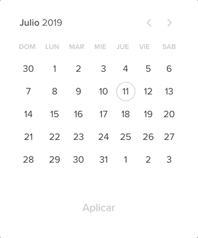

# Workshop TDD

[Aqui](https://github.com/Guusy/tdd-workshop-quickstart) esta el codigo base para arrancar los siguientes ejercicios

## Que vamos a hacer ?

1) Una billetera virtual en la cual vamos a poder:

- Hacer transacciónes
    - Las transacciónes de credito van a agregar plata a nuestra cuenta
    - Las transacciónes de debito van a restar nuestro saldo
- Ver el estado de la cuenta

Comenzemos con el [paso 1](./pasos/wallet/paso-1.md)

2) Un componente React de calendario:

Para esto vamos a concentrarnos en 2 componentes (uno dumb y otro smart)

1) `<DatePicker/>` : Render de dias (dumb)

- Un dia puede estar seleccionado o no
- Un dia puede estar habilitado o no
- Puede dibujar un rango de dias seleccionados
- El dia de hoy tiene que ver con un estilo diferente
- Renderizar un header con `[DOM, LUN, MAR, MIE, JUE, VIE, SAB]`
- Renderizar flechas para moverse entre los meses, un texto que indique el mes y año donde se encuentra posicionado
- Al clickear un dia debemos disparar un callback

2) `<Calendar/>` : Logica de manejo de dias (smart)

- Tener la posibilidad de seleccionar 1 solo dia o un rango depende del tipo de seleccion
- Si es de tipo rango, tener un maximo o un minimo de dias a seleccionar 
- Movernos hacia otro mes
- Recibir por parametro dias preselecionados
- Recibir una fecha por la cual arrancar (el mes que vamos a renderizar) o si no renderizar el mes actual
- Un boton de aplicar (opcional) (habilitado y deshabilitado del mismo)
- Recibir un callback de cuando se seleccionar una fecha o cuando se selecciona un rango 
- Recibir un  habilitado desde y hasta para la seleccion de dias
- Recibir dias especificos a desahabilitar
- Al cambiar las fechas mantener la seleccion

Comenzemos con el [paso 1](./pasos/paso-1.1.md)
